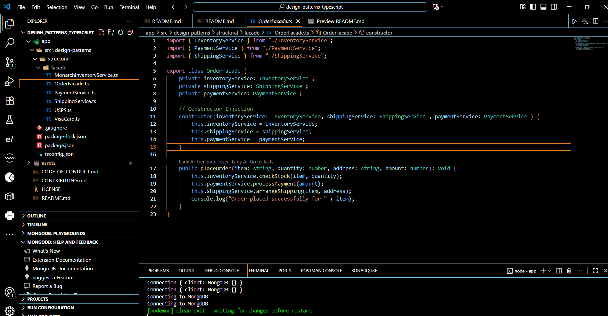
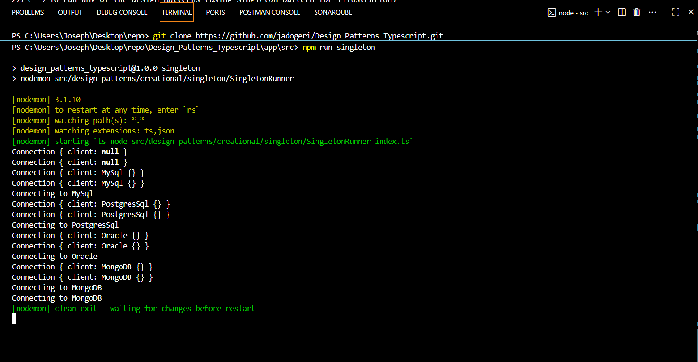

# **Design Patterns JAVA**

**Version:** 1.0.0

**Date:** September 28, 2025

---

## Description

This repository is for learning and implementing software design patterns concepts.

## Authors

[@jadogeri](https://www.github.com/jadogeri)

## Repository

[https://github.com/jadogeri/Design_Patterns_Java.git](https://github.com/jadogeri/Design_Patterns_Java.git)


## Screenshots

|  |  |
| -------------------------------------------- | -------------------------------------------- |

## Table of Contents

<ul>
    <li><a href="#1-introduction">1. Introduction</a>
        <ul>
            <li><a href="#11-purpose">1.1 Purpose</a> </li>
            <li><a href="#12-scope">1.2 Scope</a> </li>
            <li><a href="#13-intended-audience">1.3 Intended Audience</a> </li>
        </ul>
    </li>
</ul>
    <ul>
      <li><a href="#2-technology-stack">2. Technology Stack</a>
      </li>
    </ul>
    <ul>
      <li><a href="#3-project-structure">3. Project Structure</a>
      </li>
    </ul> 
    <ul>
      <li><a href="#4-installation">4. Installation</a>
      </li>
    </ul> 
    <ul>
        <li><a href="#5-usage">5. Usage</a>
        <ul>
            <li><a href="#51-run-application">5.1 Run Application</a> </li>
        </ul>
        </li>
    </ul> 
    <ul>  
        <li><a href="#6-license">6. License</a>
        </li>
    </ul> 
    <ul> 
        <li><a href="#7-references">7. References</a>
        </li>
    <ul>

## **1. Introduction**

### **1.1 Purpose**

The purpose of this project is to learn and apply software design patterns principles in java applications.

### **1.2 Scope**

This project will allow users to :

- Utilize code snippet in larger project.
- Implement SOLID principles to promote clean code.

### **1.3 Intended Audience**

- Junior or Senior backend developers.
- Beginners learning (Java) and design patterns in software engineering.

---

## **2. Technology Stack**

- **Programming Languages**: Java
- **IDE**: IntelliJ and Visual Studio Code (VSCode)
- **Plugins**: Early AI, Google AI
- **Version Control**: Git and GitHub
- **Code Analsis**: SonarQube

## **3. Project Structure**

A Java project can be structured to demonstrate various design pattern implementations. This involves organizing code into packages and classes that exemplify the principles and structures of different patterns. 
Project Structure: 
A common approach is to create a top-level package for the project, such as com.example.designpatterns. Within this, sub-packages can be created for each category of design patterns (Creational, Structural, Behavioral) and further sub-packages for individual patterns. 

```tree
design-patterns
└── src/main/java
    ├── creational
    │   ├── singleton
    │   │   ├── Connection.ts
    │   │   ├── DatabaseClient.ts
    │   │   ├── MySql.ts
    │   │   ├── Oracle.ts
    │   │   ├── MongoDB.ts
    │   │   ├── PostgresSql.ts
    │   │   └── SingletonRunner.ts
    │   ├── factory
    │   │   ├── Game.ts
    │   │   ├── GameFactory.ts
    │   │   ├── PlayStation.ts
    │   │   ├── Nintendo.ts
    │   │   ├── Xbox.ts
    │   │   ├── PlayStationFactory.ts
    │   │   ├── NintendoFactory.ts
    │   │   ├── XboxFactory.ts
    │   │   └── FactoryRunner.ts
    │   └── builder
    │       ├── Pizza.ts
    │       ├── Product.ts
    │       └── BuilderRunner.ts
    ├── structural
    │   ├── adapter
    │   │   ├── LegacyPrintable.ts
    │   │   ├── ModernPrintable.ts
    │   │   ├── LegacyPrinter.ts
    │   │   ├── PrinterAdapter.ts
    │   │   └── AdapterRunner.ts
    │   ├── decorator
    │   │   ├── Burger.ts
    │   │   ├── RegularBurger.ts
    │   │   ├── BurgerDecorator.ts
    │   │   ├── MayoDecorator.ts
    │   │   ├── OnionDecorator.ts
    │   │   ├── PickleDecorator.ts
    │   │   ├── CheeseDecoratorconsole.ts
    │   │   └── DecoratorRunnerconsole.ts
    │   └── facade
    │       ├── ApplePayconsole.ts
    │       ├── VisaCardconsole.ts
    │       ├── DHLconsole.ts
    │       ├── MonarchInventoryServiceconsole.ts
    │       ├── PaymentServiceconsole.ts
    │       ├── InventoryServiceconsole.ts
    │       ├── ShippingServiceconsole.ts
    │       ├── USPSconsole.ts
    │       ├── OrderFacadeconsole.ts
    │       └── FacadeRunnerconsole.ts
    └── behavioral
        ├── strategy
        │   ├── Cardconsole.ts
        │   ├── CreditCardStrategyconsole.ts
        │   ├── DebitCardStrategyconsole.ts
        │   ├── PaypalStrategyconsole.ts
        │   ├── PaymentStrategyconsole.ts
        │   ├── InsufficientFundsExceptionconsole.ts
        │   ├── ShoppingCartconsole.ts
        │   └── StrategyRunnerconsole.ts
        ├── observer
        │   ├── Subjectconsole.ts
        │   ├── Observerconsole.ts
        │   ├── ChatRoomconsole.ts
        │   ├── Messageconsole.ts
        │   ├── Userconsole.ts
        │   └── ObserverRunnerconsole.ts
        └── command
            ├── Commandconsole.ts
            ├── Deviceconsole.ts
            ├── Radioconsole.ts
            ├── Lightconsole.ts
            ├── Televisionconsole.ts
            ├── Lightconsole.ts
            ├── TurnOnCommandconsole.ts
            ├── TurnOffCommandconsole.ts
            ├── AdjustvolumeCommandconsole.ts
            ├── ChangeChannelCommandconsole.ts
            ├── RemoteControlconsole.ts
            └── CommandRunnerconsole.ts

```
Implementation Details: 

<ol>
Creational Patterns: 
  <li>
    Singleton: Implement a class with a private constructor, a static instance, and a static getInstance() method to ensure only one instance exists. 
  </li>
  <li>
    Factory Method: Define an interface or abstract class for products and concrete product implementations. Create a factory interface/abstract class and concrete factories to create product objects. 
  </li>
  <li>
    Builder: Create a separate builder class to construct complex objects step-by-step, allowing for flexible object creation.    
  </li>

</ol>

<ol>
 Structural Patterns: 
  <li>
    Adapter: Create an adapter class that allows incompatible interfaces to work together by converting the interface of one class into another. 
  </li>
  <li>
    Decorator: Use concrete decorator classes to add new responsibilities to objects dynamically without modifying their core structure. 
  </li>
  <li>
  Facade: The primary class, subsystems the facade interacts with and a client component or application that uses the facade to access the subsystem's. 
  </li>
  </ol>


<ol>
Behavioral Patterns: 
  <li>
    Strategy: Define an interface for a family of algorithms, encapsulate each algorithm in a separate class, and allow clients to choose the desired algorithm at runtime. 
  </li>
  <li>
    Observer: Implement a subject (publisher) and observer (subscriber) interface. The subject maintains a list of observers and notifies them of state changes. 
  </li>
  <li>
   Command: Create Command objects (e.g., TurnOnLightCommand) to encapsulate requests, executed by a RemoteControl.
  </li>
</ol>


---

## **4. Installation**

* [Download and install IntelliJ Community Edition](https://www.jetbrains.com/idea/download/?section=windows)
* [Download and install Java](https://www.oracle.com/java/technologies/downloads/)

---

## **5. Usage**

**Prerequisites** :installation of IntelliJ IDE and Java.

### **5.1 Run Application**

0 open intelliJ IDE.

1 Select option `CLONE REPOSITORY` .

2 Copy and paste url `https://github.com/jadogeri/Design_Patterns_Java.git` and choose location to save project then press clone.

 (Note!! choose empty folder : I created folder repo)


3 Change view to Project.

4 Navigate to `design_patterns` --> `src` --> `main` -- `java`.

5 To run any of the design patterns (using command pattern for illustration)
  Navigate to `behavioral` --> `command` --> `CommandRunner` .

  Note!! each pattern has a file ending in *.Runnerconsole.ts to run the app.

6 Press play button to start application.



---

## **6. License**

[LICENSE](/LICENSE)

---

## **7. References**

* Tutorialspoint : [Design Patterns in Java](https://www.tutorialspoint.com/design_pattern/index.htm).
* ForrestKnight : [7 Design Patterns EVERY Developer Should Know](https://www.youtube.com/watch?v=BJatgOiiht4&t=871s).
* CodingShuttle : [10 Essential Java Design Patterns Every Developer Should Master (With Code Examples)](https://www.codingshuttle.com/blogs/top-8-design-patterns-in-java/).
* Tpointtech : [Design Patterns in Software Engineering)](https://www.tpointtech.com/design-patterns-in-software-engineering).


